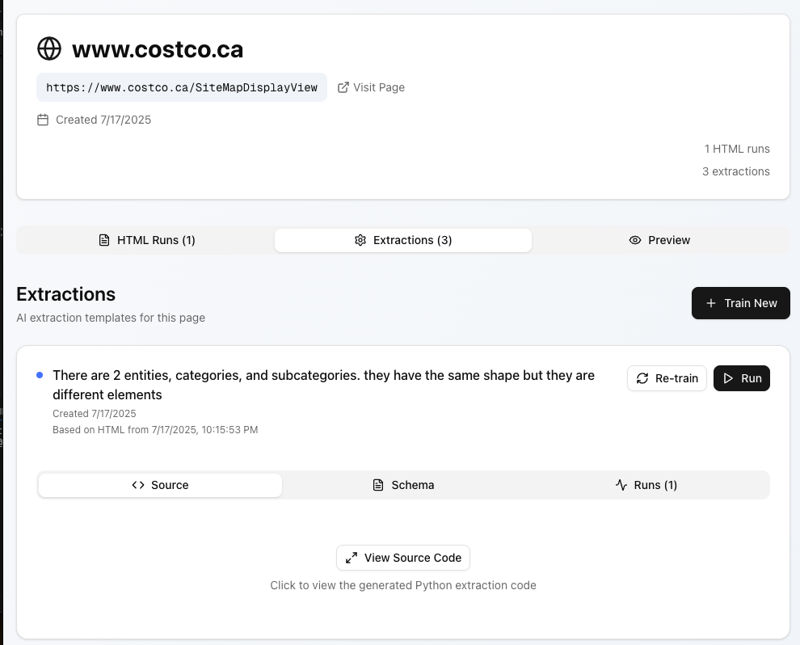

# Compass Take Home

## What It Is

**Pagent** (Page Agent) is an intelligent web scraping framework with AI-powered data extraction. Built around a callback system that dynamically generates Python extraction functions using Gen-AI, it automatically adapts to diverse HTML structures.

**Core Components:**
- **Pagent Base Class**: Playwright-controlled scraping with systematic storage
- **AI Callbacks**: Generate custom extraction functions per page type
- **CostcoWebScraper**: Domain-specific implementation with neuromorphic ETL

**Key Innovation**: AI analyzes HTML structure and generates extraction code automatically, creating self-documenting ETL functions saved alongside the data.

## Event-Driven Architecture on GCP

This system should be redesigned as an **event-driven architecture** with a central event bus:

### Architecture Components

- **Cloud Pub/Sub**: Central event bus for decoupled communication
- **Cloud Functions**: Serverless scraping workers triggered by events
- **Cloud Run**: Container-based services for AI processing
- **Firestore**: NoSQL database for flexible schema storage
- **BigQuery**: Data warehouse for analytics and querying

### Event Flow

```
URL Discovery → Pub/Sub → Scraping Workers → AI Processing → Storage → API
```

**Benefits:**
- Horizontal scaling of scraping workers
- Fault tolerance through message queuing
- Real-time processing and updates
- Cost-effective serverless compute

## The Key Idea: Self-Healing ETL Dashboard

My **ambitious vision** is a dashboard where users can:

1. **Input any URL** into the system
2. **Gen-AI infers the schema** automatically from the page structure
3. **UI guides users** to create self-healing ETL functions
4. **Common goals** are defined (extract products, categories, etc.)
5. **Endpoints inevitably drift** - the system adapts automatically

### The Problem
Web scraping breaks when sites change. Traditional ETL is rigid and requires constant maintenance.

### The Solution
**AI-powered self-healing ETL** that:
- Detects schema changes automatically
- Suggests extraction function updates
- Learns from user corrections
- Maintains data quality despite endpoint drift

This represents a paradigm shift from static scraping to **adaptive intelligence** - where the system evolves with the web itself.

## Conclusion

The `old-lib-src` solution represents a **sophisticated approach** to web scraping that evolves beyond traditional methods:

1. **Systematic Foundation** - Pagent provides reliable, organized scraping
2. **AI-Powered Adaptation** - Dynamic extraction functions that adapt to changing sites
3. **Event-Driven Scalability** - GCP architecture for production deployment
4. **Self-Healing Vision** - The ultimate goal of autonomous ETL that adapts to endpoint drift

This architecture solves the fundamental challenge: **creating resilient data pipelines that survive the ever-changing web**.


